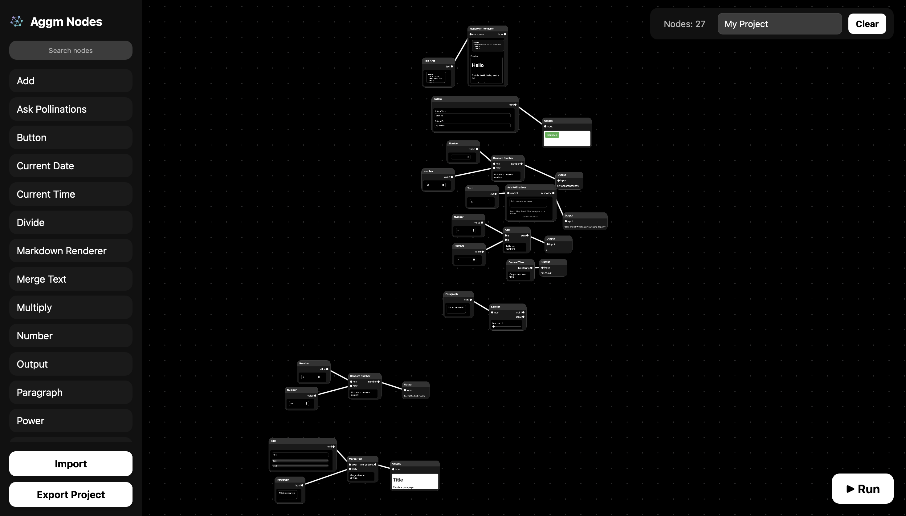

# Aggm Nodes 
## 3.0

Aggm Nodes is a node based IDE app created by Adolfo GM that allows users to visually create scripts using a node-based interface.

Version 3.0 introduces the ability to create User Interface (UI), this allows AGGM Nodes to be used to program anything, from frontend to backend, from games to web applications, and more.

## Features

- Connect nodes to form workflows
- Save and load workflows
- Export to Python code or JavaScript code
- Support to pan and zoom on the workspace
- More nodes

## License

MIT License

